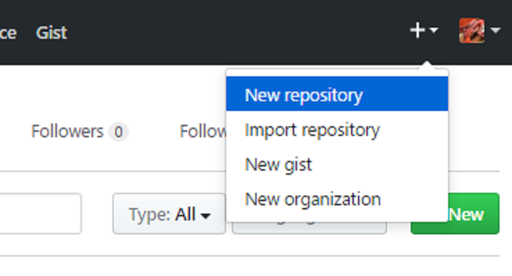
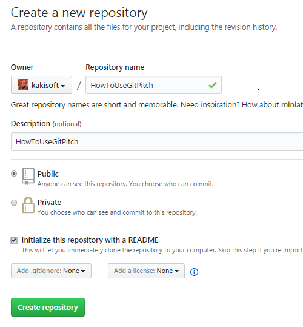
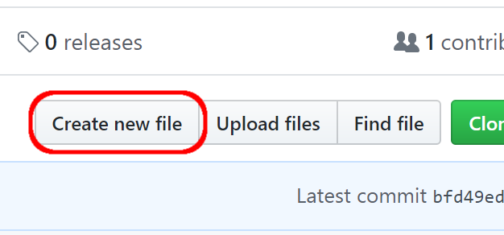
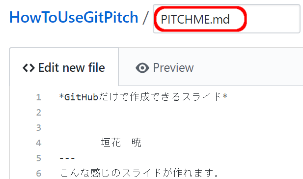

### GitHubだけで作成できるスライド
　  

　  
　  
　　　　　垣花　暁
---
こんな感じのスライドが作れます。
---
「GitPitch」というサービスを使っています。
---
必要なのは、GitHubアカウントのみ。
---
作り方
---
リポジトリを作成  

---
リポジトリ名がスライドのURLとなります。  

---
「Create New File」を選択  　

---
PITCHME.md  
というファイルを作成します。  
  
---
内容はマークダウンで記述します。
---
一方で、GitPitch独自の記法もあります。
---

```
var str1 = 'hello world';
var flag = true;
var result = 10 + 20;


console.log( str1 );
console.log( str2 );
console.log( str3 );
```
@[1-2](flagに「true」を代入)
@[3](3333flagに「true」を代入)
---
### Fragment Slides
- 要素の先頭を```\-```で記述し |
- 末尾に```\|``` を記述すると |
- １行単位で                |
- 表示することが            |
- できます                 |
---
```
\---?gist=kakisoft/92d3fc38dae2eadc97f4a2881fbfc695
```
と記述することで、Gistも表示可能です。
---
### Code Presenting

---
Commit new fileで完了です。  

---
URLは、   
　  
https://gitpitch.com/<ユーザ名>/<リポジトリ名>  
　   
となります。
---
ブランチを切って  
　  
https://gitpitch.com/<ユーザ名>/<リポジトリ名>/<ブランチ名>  
　  
とする事もできます。
---
公式サイト  
https://gitpitch.com/
---
おわり
